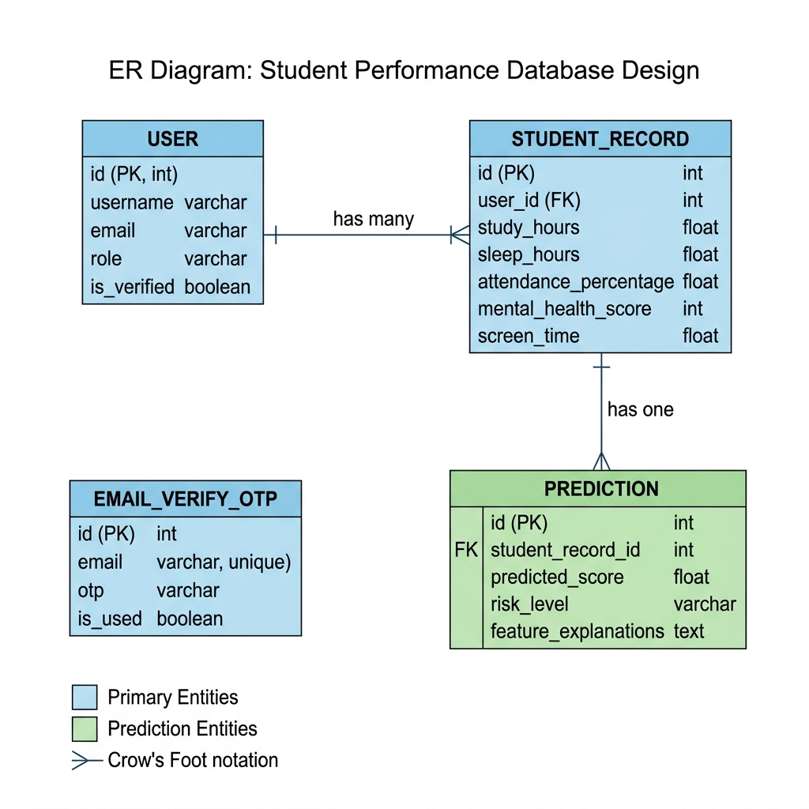
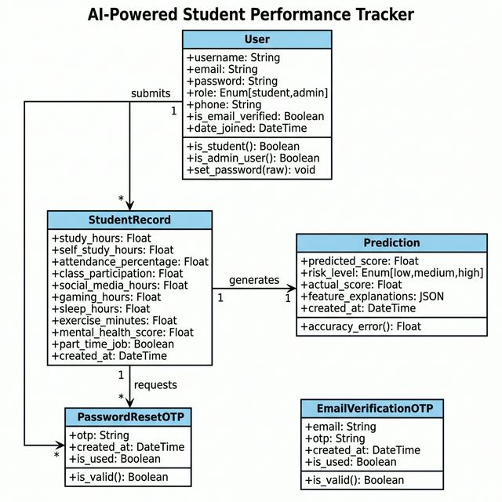
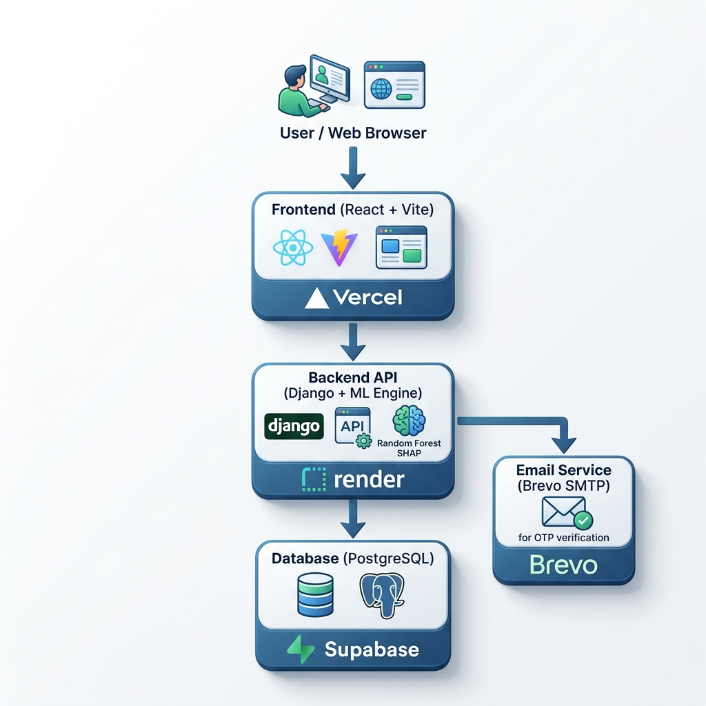

**K.L.E. SOCIETY’S**  
**P.C. JABIN SCIENCE COLLEGE,**  
**AUTONOMOUS,**  
(Affiliated to KARNATAK UNIVERSITY, DHARWAD)  
**HUBBALLI -580031**

**Bachelor of Computer Application**

**2025-26**

### A Dissertation Report On

# **AI-Powered Student Performance Tracker**

Submitted in partial fulfillment of the requirement for the award of the degree

**BACHELOR OF COMPUTER APPLICATION**

**Submitted By**

Madhav P &nbsp;&nbsp;&nbsp;&nbsp;&nbsp;&nbsp;&nbsp;&nbsp;&nbsp;&nbsp;&nbsp;&nbsp;&nbsp;&nbsp;&nbsp;&nbsp;&nbsp;&nbsp;&nbsp;&nbsp;&nbsp;&nbsp;&nbsp;&nbsp;&nbsp;&nbsp;&nbsp;&nbsp;&nbsp;&nbsp;&nbsp;&nbsp;&nbsp;&nbsp; Amruth Badi  
223204 &nbsp;&nbsp;&nbsp;&nbsp;&nbsp;&nbsp;&nbsp;&nbsp;&nbsp;&nbsp;&nbsp;&nbsp;&nbsp;&nbsp;&nbsp;&nbsp;&nbsp;&nbsp;&nbsp;&nbsp;&nbsp;&nbsp;&nbsp;&nbsp;&nbsp;&nbsp;&nbsp;&nbsp;&nbsp;&nbsp;&nbsp;&nbsp;&nbsp;&nbsp;&nbsp;&nbsp; 223183  

Guruprasad Charati  
223196

**Under The Guidance Of**  
**Prof. Soniya Madam**  
Affiliated to  
Karnatak University, Dharwad.

---

   

## CERTIFICATE

This is to certify that the project entitled **AI-Powered Student Performance Tracker** is a Bonafide work carried out by the student team Mr. **Madhav P** – Reg No 223204, Mr. **Amruth Badi** – Reg No 223183, and Mr. **Guruprasad Charati** – Reg No 223196 in partial fulfillment of the award of degree of Bachelor of Computer Application during the year 2025 – 2026. The project report has been approved as it satisfies the academic requirement with respect to the project work prescribed for the award of BCA Degree.

  

__________________ &nbsp;&nbsp;&nbsp;&nbsp;&nbsp;&nbsp;&nbsp;&nbsp;&nbsp;&nbsp;&nbsp;&nbsp;&nbsp;&nbsp;&nbsp;&nbsp;&nbsp;&nbsp;&nbsp;&nbsp;&nbsp;&nbsp;&nbsp;&nbsp;&nbsp;&nbsp;&nbsp;&nbsp;&nbsp;&nbsp;&nbsp;&nbsp;&nbsp;&nbsp;&nbsp;&nbsp;&nbsp;&nbsp;&nbsp;&nbsp;&nbsp;&nbsp;&nbsp;&nbsp;&nbsp;&nbsp;&nbsp;&nbsp;&nbsp;&nbsp;&nbsp;&nbsp;&nbsp;&nbsp;&nbsp;&nbsp;&nbsp;&nbsp;&nbsp;&nbsp;&nbsp;&nbsp;&nbsp;&nbsp;&nbsp;&nbsp;&nbsp;&nbsp;&nbsp;&nbsp;&nbsp;&nbsp;&nbsp;&nbsp;&nbsp; _____________  
**Guide** &nbsp;&nbsp;&nbsp;&nbsp;&nbsp;&nbsp;&nbsp;&nbsp;&nbsp;&nbsp;&nbsp;&nbsp;&nbsp;&nbsp;&nbsp;&nbsp;&nbsp;&nbsp;&nbsp;&nbsp;&nbsp;&nbsp;&nbsp;&nbsp;&nbsp;&nbsp;&nbsp;&nbsp;&nbsp;&nbsp;&nbsp;&nbsp;&nbsp;&nbsp;&nbsp;&nbsp;&nbsp;&nbsp;&nbsp;&nbsp;&nbsp;&nbsp;&nbsp;&nbsp;&nbsp;&nbsp;&nbsp;&nbsp;&nbsp;&nbsp;&nbsp;&nbsp;&nbsp;&nbsp;&nbsp;&nbsp;&nbsp;&nbsp;&nbsp;&nbsp;&nbsp;&nbsp;&nbsp;&nbsp;&nbsp;&nbsp;&nbsp;&nbsp;&nbsp;&nbsp;&nbsp;&nbsp;&nbsp;&nbsp;&nbsp;&nbsp;&nbsp;&nbsp;&nbsp;&nbsp;&nbsp;&nbsp;&nbsp;&nbsp;&nbsp;&nbsp;&nbsp;&nbsp;&nbsp;&nbsp;&nbsp;&nbsp;&nbsp;&nbsp;&nbsp;&nbsp; **HOD**

 

**External Examination:**

Name of the Examiners &nbsp;&nbsp;&nbsp;&nbsp;&nbsp;&nbsp;&nbsp;&nbsp;&nbsp;&nbsp;&nbsp;&nbsp;&nbsp;&nbsp;&nbsp;&nbsp;&nbsp;&nbsp;&nbsp;&nbsp;&nbsp;&nbsp;&nbsp;&nbsp;&nbsp;&nbsp;&nbsp;&nbsp;&nbsp;&nbsp;&nbsp;&nbsp;&nbsp;&nbsp;&nbsp;&nbsp;&nbsp;&nbsp;&nbsp;&nbsp;&nbsp;&nbsp;&nbsp;&nbsp;&nbsp;&nbsp;&nbsp;&nbsp;&nbsp;&nbsp;&nbsp;&nbsp;&nbsp; Signature with date

1. ______________________ &nbsp;&nbsp;&nbsp;&nbsp;&nbsp;&nbsp;&nbsp;&nbsp;&nbsp;&nbsp;&nbsp;&nbsp;&nbsp;&nbsp;&nbsp;&nbsp;&nbsp;&nbsp;&nbsp;&nbsp;&nbsp;&nbsp;&nbsp;&nbsp;&nbsp;&nbsp;&nbsp;&nbsp;&nbsp;&nbsp;&nbsp;&nbsp;&nbsp;&nbsp;&nbsp;&nbsp;&nbsp;&nbsp;&nbsp;&nbsp;&nbsp;&nbsp;&nbsp;&nbsp;&nbsp;&nbsp;&nbsp;&nbsp;&nbsp;&nbsp;&nbsp;&nbsp; ______________________

2. ______________________ &nbsp;&nbsp;&nbsp;&nbsp;&nbsp;&nbsp;&nbsp;&nbsp;&nbsp;&nbsp;&nbsp;&nbsp;&nbsp;&nbsp;&nbsp;&nbsp;&nbsp;&nbsp;&nbsp;&nbsp;&nbsp;&nbsp;&nbsp;&nbsp;&nbsp;&nbsp;&nbsp;&nbsp;&nbsp;&nbsp;&nbsp;&nbsp;&nbsp;&nbsp;&nbsp;&nbsp;&nbsp;&nbsp;&nbsp;&nbsp;&nbsp;&nbsp;&nbsp;&nbsp;&nbsp;&nbsp;&nbsp;&nbsp;&nbsp;&nbsp;&nbsp;&nbsp; ______________________

---

   

## DECLARATION

We hereby declared that the project report entitled **AI-Powered Student Performance Tracker**, submitted in fulfillment of requirement of BCA VI Semester Project work for the award of Degree in Bachelor of Computer Application of KARNATAK UNIVERSITY, Dharwad during the academic year 2025-26.

We further declare that this project report is the result of our original work and has not been submitted to any other organization or institute for the award of any degree or diploma.

  

**Date:** ...............................  
**Place:** Hubballi

  

Sign (Amruth Badi) &nbsp;&nbsp;&nbsp;&nbsp;&nbsp;&nbsp;&nbsp;&nbsp;&nbsp;&nbsp;&nbsp;&nbsp;&nbsp;&nbsp;&nbsp;&nbsp;&nbsp;&nbsp;&nbsp;&nbsp; Sign (Guruprasad Charati) &nbsp;&nbsp;&nbsp;&nbsp;&nbsp;&nbsp;&nbsp;&nbsp;&nbsp;&nbsp;&nbsp;&nbsp;&nbsp;&nbsp;&nbsp;&nbsp;&nbsp;&nbsp;&nbsp;&nbsp; Sign (Madhav P)

---

   

## ACKNOWLEDGEMENT

It's our pleasure to thank all the individuals who have directly or indirectly helped and motivated us in the fulfilment of completion of the project work.

We thank **Prof. Siddalingappa Kadakol**, HOD, KLE Society's BCA, P C Jabin Science College, HUBBALLI for having given us all encouragement and motivation for making this project work successful.

We thank our guide **Prof. Soniya Madam**, KLE Society's BCA, P C Jabin Science College, HUBBALLI for giving us valuable suggestions and guidance for our project work, which are the background of the project.

Our gratitude also goes to all **Teaching and Non-Teaching staff** of KLE Society's BCA, P C Jabin Science College, HUBBALLI who have helped us in completing this project work.

Finally, we would like to thank our family and friends for their constant motivation and inspiration that kept us going.

   

Sign (Amruth Badi) &nbsp;&nbsp;&nbsp;&nbsp;&nbsp;&nbsp;&nbsp;&nbsp;&nbsp;&nbsp;&nbsp;&nbsp;&nbsp;&nbsp;&nbsp;&nbsp;&nbsp;&nbsp;&nbsp;&nbsp; Sign (Guruprasad Charati) &nbsp;&nbsp;&nbsp;&nbsp;&nbsp;&nbsp;&nbsp;&nbsp;&nbsp;&nbsp;&nbsp;&nbsp;&nbsp;&nbsp;&nbsp;&nbsp;&nbsp;&nbsp;&nbsp;&nbsp; Sign (Madhav P)

---

   

## ABSTRACT

**AI-Powered Student Performance Tracker** is a dedicated full-stack web application designed to bridge the gap between reactive educational grading and proactive student counseling. In highly competitive academic environments, identifying a student struggling with burnout or poor performance often becomes a chaotic and delayed challenge, usually only realized after a student has failed an examination. The AI-Powered Student Performance Tracker addresses this by providing a unified platform where students can log their daily academic and lifestyle habits, and educators can monitor predictive trajectories efficiently.

The application allows users to register as either a **Student** or an **Admin**. Students can log detailed metrics including study hours, sleep patterns, screen time, and mental health scores. Admins, on the other hand, have access to a centralized dashboard that surfaces at-risk students based on AI-driven predictions. The system features a secure JWT-based authentication mechanism and Email OTP verification, ensuring data privacy and integrity.

Key features include:
*   **Role-Based Workflows:** Distinct interfaces for students (self-monitoring) and admins (batch monitoring).
*   **Real-Time Prediction Matching:** Using Random Forest models to instantly predict an exam score and categorize a student's risk level (Low, Medium, High).
*   **Explainable AI (SHAP):** Providing students with exact mathematical breakdowns of how their habits are affecting their scores (e.g., "+10% due to good sleep"), solving the AI "Black Box" problem.
*   **Batch Tracking:** Automated logging and CSV upload functionality for admins to process entire classrooms simultaneously.

Built with **PostgreSQL, Django REST Framework, React.js, and Node.js (Vite)**, the Student Performance Tracker leverages modern web technologies to ensure scalability, responsiveness, and a user-friendly experience. This project aims to digitize and optimize the educational counseling process, potentially saving students' academic careers by reducing the time taken to identify and assist those at risk.

---

   

## CONTENTS

| Slno | Topic |
| :--- | :--- |
| 1. | Introduction |
| 2. | Literature Survey |
| 3. | Technical Requirements |
| 4. | Project Description |
| 5. | System Design |
| 6. | UI Design And Outputs |
| 7. | Implementation |
| 8. | Test Case |
| 9. | Conclusion |
| 10. | Future Enhancement |
| 11. | Bibliography |

---

   

## 1. Introduction

The educational sector has always been a critical domain where timely intervention and efficient counseling can determine the difference between a student graduating or dropping out. One of the most persistent challenges in modern education is the timely identification of student burnout and impending academic failure. Despite numerous pedagogical improvements and regular grading structures, the connection between a student's daily physiological habits and their final academic success remains fragmented and often reliant on manual, disorganized methods.

The AI-Powered Student Performance Tracker is a digital initiative designed to solve this logistical bottleneck. It acts as a digital bridge between reactive grading systems and proactive student counseling. By leveraging modern web technologies, specifically a decoupled stack (PostgreSQL, Django, React), and integrating advanced Machine Learning (Random Forest) with Explainable AI (SHAP), the application provides a centralized, accessible, and efficient platform for managing student performance trajectories.

In many traditional scenarios, colleges only evaluate historical academic data (past grades) but fail to capture real-time physiological, behavioral, and psychological factors. Our system shifts this paradigm. By continuously analyzing a student's ongoing lifestyle—such as caffeine intake, mental health scores, and sleep hours—the system serves as an early warning radar, flagging students days or weeks before a critical examination.

---

## 2. Literature Survey

Educational Data Mining (EDM) has historically focused on predicting Grade Point Averages (GPA) using demographic data and historical grades. While these autoregressive models achieved high accuracy for identifying long-term academic trends, they suffered from a fatal flaw: they were entirely blind to sudden behavioral dips. If a historically straight-A student developed severe insomnia, a purely grade-based EDM model would incorrectly predict another 'A' grade.

Recent empirical studies in educational psychology have fundamentally shifted how we view student success, demonstrating strong correlations between physiological lifestyle factors (like screen time and sleep) and cognitive retention. However, standard educational software (like standalone LMS platforms) does not dynamically track these holistic habits.

Furthermore, applying Machine Learning in education faces the "Black Box" problem. If an AI predicts a student will fail, the institution must be able to justify *why* to the student. To resolve this, our literature survey pointed toward SHAP (SHapley Additive exPlanations), an algorithm based on cooperative game theory. Rather than outputting a raw prediction, SHAP calculates the exact marginal contribution of every single lifestyle feature, providing clear, actionable feedback that students can use to correct their habits.

---

## 3. Technical Requirements

### 3.1 Hardware Requirements
*   **Processor:** Intel Core i3 (10th Gen) or AMD Ryzen 3 equivalent.
*   **Memory (RAM):** 8 GB Minimum (16 GB Recommended for training ML models).
*   **Storage:** 500 MB minimum free space for source code and dependencies.
*   **Network:** Stable internet connection for Cloud Database integration.

### 3.2 Software Requirements
*   **Operating System:** Windows 10/11, macOS, or Linux.
*   **Backend Environment:** Python 3.11+.
*   **Frontend Environment:** Node.js (v18.x+) and npm.
*   **Frameworks:** Django 5.0 (Backend), Django REST Framework, React.js via Vite (Frontend).
*   **Machine Learning Libraries:** Scikit-Learn, Pandas, SHAP, Joblib.
*   **Database:** PostgreSQL (Hosted via Supabase).
*   **Styling:** Tailwind CSS v4, Framer Motion.
*   **IDE & Tools:** Visual Studio Code, Git.

---

## 4. Project Description

The AI-Powered Student Performance Tracker was developed using the Agile Methodology, focusing on rapid iteration and incremental delivery.

**Functional Requirements:**
1.  **Authentication Workflow:** The system must provide secure user registration and login functionalities, verified via a 6-digit Email OTP using Brevo SMTP, with distinct roles for Students and Admins.
2.  **Habit Logging:** Students must be able to securely input 14 specific academic and physiological metrics into the system.
3.  **Real-Time AI Inference:** The backend must parse the submitted data through serialized Random Forest `.pkl` models to generate an instant predicted score and Risk Level (Low, Medium, High).
4.  **Admin Command Center:** Admins must be able to view a global list of students, filter them by risk severity, and perform Batch CSV uploads to predict hundreds of outcomes simultaneously.

**Non-Functional Requirements:**
*   **Security:** All API endpoints must be protected using short-lived JSON Web Tokens (JWT), and passwords must be hashed using PBKDF2.
*   **Performance:** Machine Learning inference and SHAP generation must execute and respond in under 2.0 seconds.
*   **Responsiveness:** The UI must be fully responsive (Glassmorphism design) across desktop and mobile devices.

---

## 5. System Design

The application utilizes a **3-Tier Decoupled Architecture**:
1.  **Presentation Tier:** React.js frontend that manages UI state and user inputs.
2.  **Application Tier:** Django backend that handles business logic, security authentication, and Machine Learning matrix transformations.
3.  **Data Tier:** PostgreSQL database for relational data storage.

### 5.1 ER Diagram

### 5.2 UML Class Diagram

---

## 6. UI Design And Outputs

The UI follows a modern **Glassmorphism** design language, utilizing backdrop blurs, dark-mode themes, and specific color psychology to communicate urgency.

1.  **Landing Page:** Features animated Hero sections and clear calls to action for Student and Admin logins.
2.  **Student Dashboard:** The core UI element. It displays the predicted score in a massive, readable font. Below the score, an "Impact Bar Chart" uses red bars to show habits negatively affecting the score, and green bars for habits positively affecting the score.
3.  **Admin Command Center:** A dense, data-rich table. It includes pagination, search filters, and a prominent "Batch CSV Upload" modal for mass processing.
4.  **Risk Indicators:** Emerald Green signifies Low Risk, Amber signifies Medium Risk, and Rose Red signifies High Risk, allowing instant visual triage.

**UI Screenshots:**

*Figure 1: Landing Page with Glassmorphism UI*

*Figure 2: Student Dashboard displaying AI Prediction and SHAP Impact Chart*

*Figure 3: Admin Dashboard with Batch CSV Upload Feature*

*(Note: To make these images appear, just take screenshots of your website, name them `home_page.png`, `student_dashboard.png`, and `admin_dashboard.png`, and place them in this exact folder!)*

---

## 7. Implementation

The implementation phase transitioned our architecture into a production-grade application.

**Backend Setup:**
Virtual environments (`venv`) were strictly enforced to isolate dependencies. We utilized `joblib` to serialize the optimal Random Forest models (`rf_regressor.pkl` and `rf_classifier.pkl`). By embedding these within the Django repository, the system performs ML inference natively and offline, avoiding expensive external API calls.

**Frontend Setup:**
Vite was chosen over traditional Create-React-App to provide near-instant Hot Module Replacement (HMR). Axios interceptors were configured to automatically attach JWT Bearer tokens to every outgoing HTTP request, ensuring seamless and secure communication with the Django API.

**Cloud Deployment:**
The project adopted a multi-cloud deployment strategy:
*   **Database:** Supabase (PostgreSQL).
*   **Backend:** Render Web Services (Running Gunicorn WSGI).
*   **Frontend:** Vercel Edge Network.
Cross-Origin Resource Sharing (CORS) was strictly configured in Django to only accept payloads originating from the Vercel domain.

*Figure 4: Full-Stack Cloud Deployment Architecture*

---

## 8. Test Case

| Slno | Scenario | Expected Result | Actual Result |
| :--- | :--- | :--- | :--- |
| 1. | Register with an existing email address. | System denies registration and displays error. | PASS |
| 2. | Register and input an incorrect 6-digit OTP. | System displays "Invalid or expired OTP" error. | PASS |
| 3. | Unauthenticated user attempts to access prediction API. | Backend rejects request with HTTP 401 Unauthorized. | PASS |
| 4. | Student submits impossible values (e.g., 30 hours of sleep). | Frontend HTML5 validation blocks form submission. | PASS |
| 5. | Student submits high-risk data (0 study hours, poor mental health). | System returns a low predicted score and "High Risk" badge. | PASS |
| 6. | Verify SHAP Explainability JSON output format. | System returns array of feature impacts mapping directly to input. | PASS |
| 7. | Admin uploads a valid 100-row CSV file. | Backend parses data, runs 100 ML inferences, saves to DB, returns Success. | PASS |

---

## 9. Conclusion

The completion of the AI-Powered Student Performance Tracker represents a successful synthesis of modern web development and advanced data science. We set out to solve a deeply ingrained problem in the educational system: the reactive nature of student evaluation. 

By leveraging the power of Random Forest ensemble learning on a massive 10,000-record dataset, we created a highly accurate predictive engine. More importantly, by integrating Explainable AI (SHAP), we ensured that our technological solution remains transparent, providing actionable counseling advice rather than opaque predictions. The decoupled architecture resulted in a production-grade application that proves Machine Learning can be effectively utilized to construct a proactive safety net for students.

---

## 10. Future Enhancement

While the current iteration is fully functional, future expansions could include:
1.  **Automated Email Alerts:** Integrating Celery and Redis to automatically send warning emails to counselors if a student is flagged as "High Risk" over three consecutive submissions.
2.  **LMS API Integration:** Automatically pulling live quiz scores and attendance logs from platforms like Canvas or Moodle, replacing the need for manual data entry.
3.  **Conversational AI Chatbot:** Implementing an LLM that reads a student's SHAP values and initiates a chat offering targeted advice (e.g., sleep-hygiene techniques).

---

## 11. Bibliography

1.  Breiman, L. (2001). "Random Forests". *Machine Learning*, 45(1), 5-32.
2.  Lundberg, S. M., & Lee, S. I. (2017). "A Unified Approach to Interpreting Model Predictions". *Advances in Neural Information Processing Systems (NeurIPS) 30*.
3.  Django Software Foundation. (2024). *Django Documentation (Version 5.0)*.
4.  Meta Platforms, Inc. (2024). *React Documentation (Version 18)*.
5.  Qureshi, N. (2023). *Student Performance Dataset* [Data set]. Kaggle.
6.  Sampath, V. (2024). *Ultimate Student Productivity Dataset* [Data set]. Kaggle.
