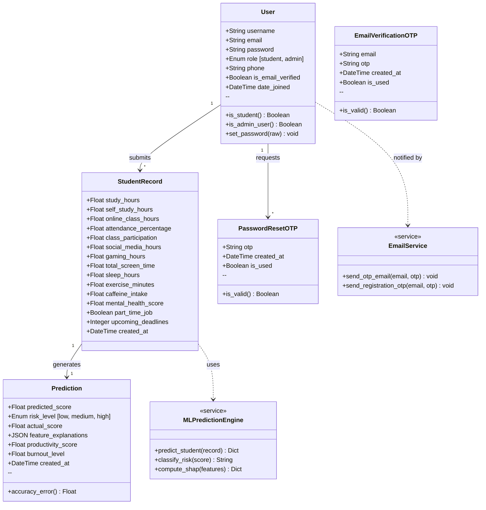

# Object-Oriented Analysis & Use Case Analysis
## AI-Powered Student Performance Tracker

**Submitted to:** Nikita Mam  
**Project By:** Madhav P  
**Date:** 27 March 2026

---

## Part 1: Object-Oriented Analysis

### 1.1 Identified Classes and Objects

The system is composed of **5 core classes** and **2 service-layer classes** that encapsulate the ML engine and the email notification system.

---

#### Class 1: `User` (extends AbstractUser)

| Attribute | Type | Description |
|---|---|---|
| `username` | String | Unique login username |
| `email` | EmailField (unique) | User's email address |
| `password` | String (hashed) | Encrypted password |
| `role` | Enum (`student`, `admin`) | Determines access permissions |
| `phone` | String (optional) | Contact number |
| `is_email_verified` | Boolean | Whether the email has been verified |
| `date_joined` | DateTime | Auto-set on registration |

| Method | Return Type | Description |
|---|---|---|
| `is_student` | Boolean | Returns `True` if role is `student` |
| `is_admin_user` | Boolean | Returns `True` if role is `admin` |
| `set_password(raw)` | void | Hashes and saves a new password |
| `__str__()` | String | Returns `"username (role)"` |

---

#### Class 2: `StudentRecord`

| Attribute | Type | Description |
|---|---|---|
| `user` | ForeignKey → User | Owner of this record |
| `study_hours` | Float | Daily study hours (0–24) |
| `self_study_hours` | Float | Weekly self-study hours |
| `online_class_hours` | Float | Weekly online class hours |
| `attendance_percentage` | Float | Attendance % (0–100) |
| `class_participation` | Float | Participation score (0–10) |
| `social_media_hours` | Float | Daily social media usage |
| `gaming_hours` | Float | Daily gaming hours |
| `total_screen_time` | Float | Total daily screen hours |
| `sleep_hours` | Float | Daily sleep hours |
| `exercise_minutes` | Float | Daily exercise in minutes |
| `caffeine_intake` | Float | Daily caffeine intake (mg) |
| `mental_health_score` | Float | Mental health score (1–10) |
| `part_time_job` | Boolean | Has a part-time job? |
| `upcoming_deadlines` | Integer | Number of upcoming deadlines |
| `created_at` | DateTime | Auto-set on creation |

| Method | Return Type | Description |
|---|---|---|
| `__str__()` | String | Returns record summary with username and date |

---

#### Class 3: `Prediction`

| Attribute | Type | Description |
|---|---|---|
| `student_record` | OneToOne → StudentRecord | The record this prediction is based on |
| `predicted_score` | Float | ML-predicted exam score (0–100) |
| `risk_level` | Enum (`low`, `medium`, `high`) | Risk classification |
| `actual_score` | Float (nullable) | Real exam score (filled later by admin) |
| `feature_explanations` | JSON | SHAP values explaining each feature's impact |
| `productivity_score` | Float (nullable) | Extra ML output |
| `burnout_level` | Float (nullable) | Extra ML output |
| `created_at` | DateTime | Auto-set on creation |

| Method | Return Type | Description |
|---|---|---|
| `accuracy_error` | Float / None | `|predicted − actual|` if actual exists |
| `__str__()` | String | Returns score and risk summary |

---

#### Class 4: `PasswordResetOTP`

| Attribute | Type | Description |
|---|---|---|
| `user` | ForeignKey → User | The user requesting the reset |
| `otp` | String (6 digits) | One-time password code |
| `created_at` | DateTime | Auto-set on creation |
| `is_used` | Boolean | Whether the OTP has been consumed |

| Method | Return Type | Description |
|---|---|---|
| `is_valid()` | Boolean | `True` if not expired (10 min) and not used |

---

#### Class 5: `EmailVerificationOTP`

| Attribute | Type | Description |
|---|---|---|
| `email` | EmailField | Email to verify (user doesn't exist yet) |
| `otp` | String (6 digits) | One-time password code |
| `created_at` | DateTime | Auto-set on creation |
| `is_used` | Boolean | Whether the OTP has been consumed |

| Method | Return Type | Description |
|---|---|---|
| `is_valid()` | Boolean | `True` if not expired (10 min) and not used |

---

#### Service Class: `MLPredictionEngine` (Logical / Non-ORM)

| Method | Return Type | Description |
|---|---|---|
| `predict_student(record)` | Dict | Runs Random Forest model, returns predicted score, risk level, and SHAP explanations |
| `_classify_risk(score)` | String | Maps score to `high` / `medium` / `low` |
| `_compute_shap(features)` | Dict | Generates per-feature SHAP impact values |

#### Service Class: `EmailService` (Logical / Non-ORM)

| Method | Return Type | Description |
|---|---|---|
| `send_otp_email(email, otp)` | void | Sends password reset OTP via Brevo SMTP |
| `send_registration_otp(email, otp)` | void | Sends registration verification OTP via Brevo SMTP |

---

### 1.2 Associations & Cardinality

| Association | Type | Description |
|---|---|---|
| `User` → `StudentRecord` | **One-to-Many (1:N)** | One user can have many student records over time |
| `StudentRecord` → `Prediction` | **One-to-One (1:1)** | Each student record produces exactly one prediction |
| `User` → `PasswordResetOTP` | **One-to-Many (1:N)** | One user can request multiple OTPs |
| `Email` → `EmailVerificationOTP` | **One-to-Many (1:N)** | One email can have multiple verification OTPs |
| `User` → `MLPredictionEngine` | **Uses** | User triggers predictions via API |
| `User` → `EmailService` | **Uses** | System sends emails to User |

---

### 1.3 UML Class Diagram



---

## Part 2: Use Case Analysis

### 2.1 Identified Actors

| Actor | Type | Description |
|---|---|---|
| **Student / Parent** | Primary | Registers, logs in, submits academic data, views predictions and alerts |
| **Admin (Teacher)** | Primary | Monitors all students, enters actual scores, deletes users, uploads CSV data |
| **ML Engine** | Secondary (System) | Processes student data and generates predictions with SHAP explanations |
| **Email Service (Brevo SMTP)** | Secondary (System) | Sends OTP emails for registration and password reset |

---

### 2.2 Identified Use Cases

| # | Use Case | Actor(s) | Description |
|---|---|---|---|
| UC1 | Register with Email Verification | Student, Email Service | Student provides email → system sends OTP → student verifies → account created |
| UC2 | Login | Student, Admin | Authenticate via JWT tokens (access + refresh) |
| UC3 | Forgot Password | Student, Admin, Email Service | Request OTP → verify OTP → reset password |
| UC4 | Submit Academic Data | Student | Fill in daily habits (study hours, sleep, screen time, etc.) |
| UC5 | Run AI Prediction | Student, ML Engine | System runs Random Forest model on submitted data → returns predicted score + risk + SHAP |
| UC6 | View Dashboard & Alerts | Student | View latest prediction, trend charts, and personalized risk alerts |
| UC7 | View Trend Analysis | Student | View historical prediction trends over multiple submissions |
| UC8 | View All Students | Admin | Admin sees all student predictions in a command center table |
| UC9 | Enter Actual Score | Admin | After real exams, admin inputs actual score for accuracy tracking |
| UC10 | Delete Student Account | Admin | Admin removes a student and all their associated data |
| UC11 | Upload Bulk CSV Data | Admin | Admin uploads a CSV file for batch predictions |
| UC12 | Export Data to CSV | Admin | Admin downloads filtered prediction data as a CSV file |
| UC13 | Transfer Admin Rights | Admin | Current admin creates a new admin account for succession |
| UC14 | View Accuracy Analytics | Admin | Admin views model accuracy stats (predicted vs actual scores) |

---

### 2.3 Use Case Diagram

```mermaid
graph LR
    subgraph Actors
        S["👨‍🎓 Student / Parent"]
        A["👩‍🏫 Admin (Teacher)"]
        ML["🤖 ML Engine"]
        EM["📧 Email Service"]
    end

    subgraph System["AI-Powered Student Performance Tracker"]
        UC1["UC1: Register with Email Verification"]
        UC2["UC2: Login (JWT)"]
        UC3["UC3: Forgot Password"]
        UC4["UC4: Submit Academic Data"]
        UC5["UC5: Run AI Prediction"]
        UC6["UC6: View Dashboard & Alerts"]
        UC7["UC7: View Trend Analysis"]
        UC8["UC8: View All Students"]
        UC9["UC9: Enter Actual Score"]
        UC10["UC10: Delete Student Account"]
        UC11["UC11: Upload Bulk CSV"]
        UC12["UC12: Export Data to CSV"]
        UC13["UC13: Transfer Admin Rights"]
        UC14["UC14: View Accuracy Analytics"]
    end

    S --> UC1
    S --> UC2
    S --> UC3
    S --> UC4
    S --> UC5
    S --> UC6
    S --> UC7

    A --> UC2
    A --> UC3
    A --> UC8
    A --> UC9
    A --> UC10
    A --> UC11
    A --> UC12
    A --> UC13
    A --> UC14

    UC1 --> EM
    UC3 --> EM
    UC5 --> ML
    UC11 --> ML
end
```

---

### 2.4 Detailed Use Case Description — UC5: Run AI Prediction

| Field | Description |
|---|---|
| **Use Case ID** | UC5 |
| **Name** | Run AI Prediction |
| **Actors** | Student (Primary), ML Engine (Secondary) |
| **Precondition** | Student is logged in and has submitted at least one StudentRecord |
| **Main Flow** | 1. Student clicks "Get Prediction" on the Dashboard |
|  | 2. System retrieves the latest StudentRecord |
|  | 3. System sends the 15 input features to the ML Engine |
|  | 4. ML Engine runs the Random Forest model |
|  | 5. ML Engine computes SHAP values for explainability |
|  | 6. System saves Prediction (score, risk, SHAP) to database |
|  | 7. System returns the result to the Student Dashboard |
| **Postcondition** | A new Prediction record is created and displayed to the student |
| **Alternate Flow** | If prediction already exists for the record, system returns the cached result |
| **Exception Flow** | If ML model file is missing, system returns a 500 error with a descriptive message |

---

### 2.5 Detailed Use Case Description — UC1: Register with Email Verification

| Field | Description |
|---|---|
| **Use Case ID** | UC1 |
| **Name** | Register with Email Verification |
| **Actors** | Student (Primary), Email Service (Secondary) |
| **Precondition** | User has a valid email address not already registered |
| **Main Flow** | 1. Student enters their email on the Registration page |
|  | 2. System generates a 6-digit OTP |
|  | 3. System sends the OTP to the student's email via Brevo SMTP |
|  | 4. Student receives the email and enters the OTP |
|  | 5. System verifies the OTP (not expired, not used) |
|  | 6. Student fills username, password, and other details |
|  | 7. System creates the User account with `role='student'` |
| **Postcondition** | A new verified User account exists in the database |
| **Alternate Flow** | If email is already registered, system returns an error message |
| **Exception Flow** | If SMTP fails, system returns "Failed to send email" error |

---

### 2.6 Detailed Use Case Description — UC9: Enter Actual Score

| Field | Description |
|---|---|
| **Use Case ID** | UC9 |
| **Name** | Enter Actual Score |
| **Actors** | Admin (Primary) |
| **Precondition** | Admin is logged in; a Prediction record exists for the student |
| **Main Flow** | 1. Admin navigates to the Admin Command Center |
|  | 2. Admin locates the student in the predictions table |
|  | 3. Admin clicks the "Edit" icon next to the student's row |
|  | 4. Admin enters the actual exam score (0–100) |
|  | 5. System validates the score and saves it to the Prediction |
|  | 6. System calculates `accuracy_error = |predicted − actual|` |
| **Postcondition** | The Prediction record now has an `actual_score` for accuracy tracking |
| **Alternate Flow** | If score is out of range (< 0 or > 100), system shows a validation error |

---

*End of Document*
